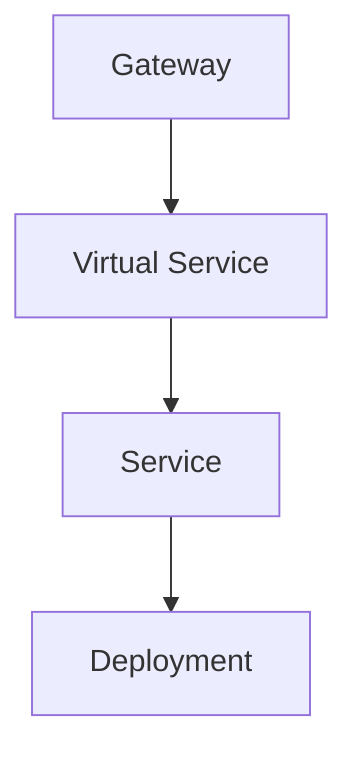

# Istio Classic

## Flow


## Gateway
```yaml
  apiVersion: networking.istio.io/v1alpha3
  kind: Gateway
  metadata:
    name: helloworld-gw
  spec:
    selector:
      istio: ingressgateway
    servers:
      - port:
          number: 80
          name: http
          protocol: HTTP
        hosts:
          - "helloworld.local"
```

## Virtual Service
```yaml
apiVersion: networking.istio.io/v1alpha3
kind: VirtualService
metadata:
  name: helloworld-vs
spec:
  hosts:
    - "helloworld.local"
  gateways:
    - helloworld-gw
  http:
    - match:
        - uri:
            exact: /hello
      route:
        - destination:
            host: helloworld
            port:
              number: 5000
```


## Service
```yaml
apiVersion: v1
kind: Service
metadata:
  name: helloworld-svc
  labels:
    app: helloworld
    service: helloworld
spec:
  ports:
    - port: 5000
      name: http
  selector:
    app: helloworld
```


## Deployment
```yaml
apiVersion: apps/v1
kind: Deployment
metadata:
  name: helloworld-deployment
  labels:
    app: helloworld
    version: v1
spec:
  replicas: 1
  selector:
    matchLabels:
      app: helloworld
      version: v1
  template:
    metadata:
      labels:
        app: helloworld
        version: v1
    spec:
      containers:
        - name: helloworld
          image: docker.io/istio/examples-helloworld-v1
          resources:
            requests:
              cpu: "100m"
          imagePullPolicy: IfNotPresent #Always
          ports:
            - containerPort: 5000
```